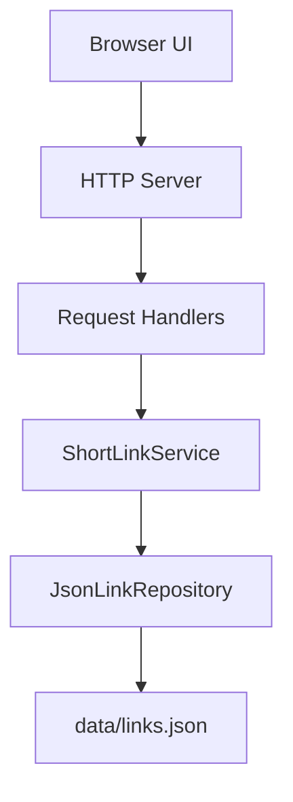
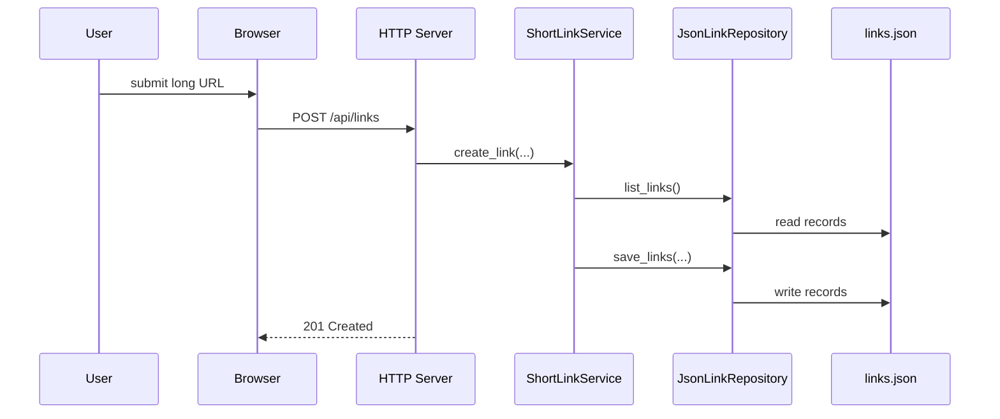
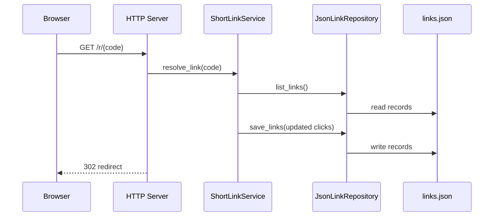

# ARCHITECTURE.md

## Overview

The system is a small layered web application built with the Python standard library.

## System Boundary

- External actor: browser user
- Internal system: HTTP server, domain service, JSON repository
- Storage boundary: local file persistence in `data/links.json`

## Layers

- `static/`: HTML, CSS, and JavaScript user interface
- `server.py`: HTTP routing and JSON/redirect responses
- `service.py`: domain rules, validation, expiration, click counting
- `repository.py`: persistence abstraction over a JSON file

## Component Responsibilities

- Browser UI: sends create/list/delete requests and renders link data
- HTTP server: maps routes, parses payloads, returns JSON or redirect responses
- Service layer: validates URLs, generates short codes, enforces expiration rules
- Repository layer: loads and saves serialized link records
- Data file: stores the current system state in a simple format for the lab

## Data Flow

1. The browser sends API requests to the HTTP server.
2. Route handlers deserialize input and call the service.
3. The service validates input, applies business rules, and updates domain state.
4. The repository writes changes to `data/links.json`.
5. The server returns JSON responses or HTTP redirects.

## Request Scenarios

### Create Link

### Redirect and Click Tracking

## Design Decisions

- Keep business logic out of the HTTP layer so tests stay simple.
- Use a repository abstraction even for JSON storage so future migration stays clean.
- Use plain JavaScript on the frontend to minimize setup cost and keep the code inspectable.
- Keep the architecture intentionally small so it remains explainable during oral review.
